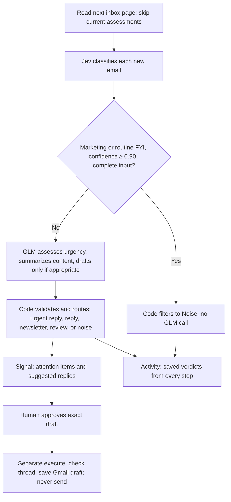
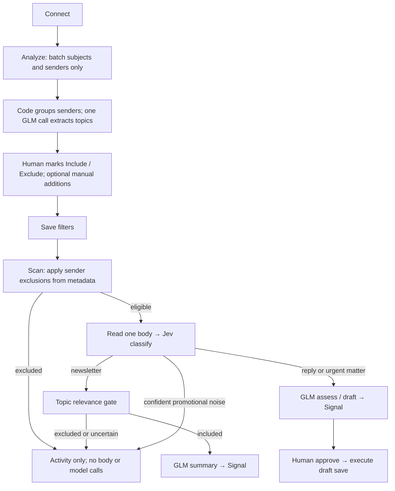

# agent-swarm

Small task agents with deterministic control loops, narrow model calls, and human
approval for external actions. Each agent lives under `agents/<name>/`; shared
provider clients live in `providers/` and the terminal interface in `tui/`.

## Run the agent MVP

```bash
.venv/bin/python -m pip install -r requirements-mvp.txt
.venv/bin/python -m mvp.terminal
```

Type a goal in chat, review the proposed finish line and measurable markers, then say **start** for one ready task,
**start 4** for task 4, or describe a change. **Inspect** opens proposed work and
an **Agents** tile grid with live activity and reports. For human tasks, do the
work yourself and send **done: [evidence]**; an evaluator checks it against the
earlier research before the task can complete. `/goal` shows the target definitions
and evidence requirements. Completion requires proof of the markers, not just finished tasks. Say **stop** or
**resume** to control work; `/open` lists saved chats.
For the saved live example: `.venv/bin/python -m mvp.terminal --run morning-demo`.

See the [morning testing guide](docs/morning-test.md) for the complete walkthrough,
recovery behavior, supported capabilities, and limits. Research is currently the
connected specialist. Model operations use the existing `.env` and are billable.

## Living-plan MVP checkpoints

The new MVP is developed separately under `mvp/`. Stage 1 is an offline
LangGraph save/block/revise/resume example. Stage 2 performs real research through
API-backed responsible and specialist agents, using LangChain tools and LangGraph
checkpoints. Use the Python 3.12 `.venv` for these commands:

```bash
.venv/bin/python -m pip install -r requirements-mvp.txt
.venv/bin/python -m mvp.live "Compare SQLite and JSON files for saving an agent's progress. Use official sources." --run first-research
.venv/bin/python -m mvp.live --show first-research
```

Stage 2 loads the repository `.env`, uses `OPENROUTER_API_KEY`, and makes billable
model calls. Choose a new run name for each task. Reports, evidence and activity
are saved in `.agent-state/mvp/live/`. See [Stage 2 instructions](docs/stage2.md)
and the [stage map](docs/mvp-stages.md).

Stage 3 turns a goal into a saved, editable plan and pauses before execution:

```bash
.venv/bin/python -m mvp.project create "Research two meeting-notes tools, then recommend a small MVP for consultants." --run first-plan
.venv/bin/python -m mvp.project show first-plan
.venv/bin/python -m mvp.project start first-plan --revision 1
```

See [Stage 3 instructions](docs/stage3.md) for editing and evaluation. Research
steps use Stage 2; other specialist assignments are marked unavailable. Stage 4 adds automatic replanning after task results and a `revise` command for
new constraints. See [Stage 4 instructions](docs/stage4.md). Stages 5 and 6 add the interactive terminal, recovery and final goal checks; see
the [complete testing guide](docs/morning-test.md). Existing email/calendar
commands below are unchanged.

## Your inbox, simplified

The email agent surfaces urgent matters needing a reply, summarizes useful
newsletters, and filters promotional noise. The main screen contains only emails needing your attention. The process stays in the background.

```bash
source .venv/bin/activate
set -a
source .env
set +a
python -m tui
```

The default TUI opens disconnected, without placeholder emails or saved demo data.
For an explicit offline demo, `python3 -m tui --demo` uses
only Python 3.9+ and its standard library. For Gmail, install the optional Google
libraries and follow [GCP setup](docs/gmail-setup.md). Press **C — Connect Gmail**
inside the Email tab. No separate authentication command is required.

The screen contains a **Gmail agent** tab, **Connect**, **Analyze**, and **Scan** buttons, and
**Signal**: only urgent replies, other reply requests, and matters needing your
review, plus summaries of newsletters that pass your intent filters. Promotions
and routine notifications do not occupy Signal.

Select an email with **↑↓**; use **PgUp/PgDn** to read. **Approve [A]** and
**Reject [X]** are text actions in the selected email. After approval, **Execute
[E]** appears there. These actions also accept mouse clicks where supported.
Execution saves a draft and never sends mail; an item without a draft records an
acknowledgment only. Completed/rejected items leave Signal.

Scanning runs in the background without changing the view. **L** opens the detailed
Activity view when needed, including saved step verdicts and newsletter summaries;
**L** returns to Signal. There is no visible Noise/Activity tab strip or global
review toolbar. **Q** quits. **Tab/Shift+Tab** switches future agent tabs.

Marketing is hidden from Signal, not deleted or archived in Gmail. Summaries and
filtered results remain saved and inspectable in Activity. The CLI remains
available for demo resets and other development operations.

Signal shows accumulated unresolved attention items from all scans for the account
and query. Its header gives the received-date span of the emails actually shown,
the requested inbox window, last scan time (local timezone), and whether more
backlog remains. Each press of Scan advances one page of up to 50 emails; it does not
review the entire backlog automatically. A date span is not a guarantee that every
email between those dates has been scanned. After a pass completes, the next Scan
starts a fresh pass and skips already assessed messages.

Signal is populated progressively: after reading the page for sender-frequency
context, each assessed email is saved and immediately published to the UI. You
do not wait for all 50 assessments. Page number and assessed/total counts appear
while scanning. Partial results survive later failures; the page cursor advances
only after the page completes. A retry skips the successfully assessed messages.
Press Scan again for the next page. New results preserve the email currently
selected for reading, even when urgent items sort above it.

The default query covers inbox mail newer than 30 days, not all historical or
archived mail. Change `GMAIL_QUERY` to scan a different window (`GMAIL_QUERY=` for
the entire inbox). Unresolved saved items are retained even as a rolling query
ages; the displayed received dates describe those saved results. Earlier records
without dates or scan timestamps are labeled unknown rather than assigned guessed
dates. New scans record Gmail's received timestamp and assessment timestamps.

## Simple architecture

| File | Responsibility |
| --- | --- |
| [control_loop.py](agents/email/control_loop.py) | Page through inbox, route work, save proposals and step verdicts, enforce approval. |
| [tools.py](agents/email/tools.py) | Gmail, classifier, and model contracts; typed messages and assessments. |
| [tool_implementations.py](agents/email/tool_implementations.py) | Jev questions, GLM prompt and validation, callback adapters, offline fixtures. |
| [agent.py](agents/email/agent.py) | Provider wiring, account-specific state, locking/checkpoints, CLI. |



Jev's categories are `urgent_reply`, `reply`, `newsletter`, `marketing`,
`informational`, and `needs_attention`. Promotional scarcity is explicitly not
personal urgency. Confident noise can skip GLM regardless of the handling score;
that score is about reply handling ability, not relevance. Newsletters pass the
intent gate before GLM produces takeaways. Held/excluded newsletters skip GLM.
Other uncertain/incomplete inputs also get assessed. A
classifier/model disagreement about potentially actionable mail cannot silently
hide it as noise.

Each Scan processes up to 50 messages. Metadata is read first in one Gmail batch
(or reused from Analyze). Sender frequency uses the whole page plus saved
observations. Excluded senders skip all body and model calls; remaining bodies are
read and assessed one at a time so Signal fills progressively. Code counts distinct message IDs, normalizes sender email
addresses, and reports observed totals and 7-/30-day counts where timestamps are
known. Both Jev and GLM receive this small context. The actual From address is used
when available, separately from the Reply-To destination. Counts reflect partial
scanned history, not the whole mailbox; missing dates are explicitly counted.
High frequency is a clue, never a deterministic marketing rule. Useful recurring
newsletters and personal requests must still be judged on their content.
Frequency evidence is saved in each email's Activity verdicts.

GLM returns the category, summary, reply requirement, handling score, reason, and
optional draft. Category and reply consistency are validated in code. The 0.85
handling threshold remains an internal assessment, never permission to act.
Urgency and handling scores have not been calibrated on your inbox. No token or
accuracy improvement is claimed without measurement.

## Models and Gmail

Fill the gitignored `.env` from [.env.example](.env.example), then export it as
shown above. Python does not load `.env` automatically.

- `TYPESAFE_API_KEY`: Jev through the [official TypeSafe API](https://docs.typesafe.ai/introduction/quickstart).
  `TYPESAFE_MODEL` defaults to `jev-latest`.
- `OPENROUTER_API_KEY`: GLM through OpenRouter. `OPENROUTER_MODEL` defaults to
  `z-ai/glm-5.3-flash`. JSON output, no tools, 4,096-token output limit.
- `GMAIL_CLIENT_SECRET_FILE`: downloaded Desktop OAuth client JSON. See
  [Gmail setup](docs/gmail-setup.md) for the exact Google Cloud steps.

Live scans send bounded email text to Jev and, when needed, OpenRouter. Jev and
GLM requests use 30- and 60-second timeouts respectively. Gmail access uses OAuth;
credentials and tokens stay in `.secrets/`. The default inbox query is
`newer_than:30d`; set `GMAIL_QUERY=` for the whole inbox. `GMAIL_ACCOUNT` optionally
checks the selected account.

## State, review, and limitations

State is stored in gitignored `.agent-state/` with owner-only file permissions
and an exclusive lock. Live state is separated by account/query and shared
between the CLI and TUI. The TUI demo uses `email-tui-demo.json`; the CLI demo
uses `email-jev-demo.json`. The four demo emails cover a normal reply, urgent
budget request, newsletter, and promotion. All demo provider calls are scripted.

Earlier pending assessments are reclassified under this policy when a scan
encounters them again. Existing approvals, rejections, and completed actions are
preserved. Old unclassified items remain visible for review rather than being
silently hidden. Older records lack some step verdicts. Scan through a full pass
to revisit earlier pending emails.

Only a single email body is evaluated; there is no extra thread-context retrieval
or attachment analysis. Truncated inputs and unread content stay in Signal for
review. Before saving a draft, the adapter checks the destination and for newer
thread messages, then preserves RFC reply headers. Replies target one Reply-To
or From address, not reply-all. Gmail can change after that preflight check.

A changed approved draft cannot execute. Ambiguous/interrupted writes become
`uncertain` and are not retried; inspect Gmail before manually reconciling state.
No revision UI exists yet. Local state is trusted storage, not an authenticated
approval ledger. Only a trusted human-facing interface may call `review`.

## CLI and extensions

```bash
python -m agents.email.agent --live analyze
python -m agents.email.agent --live filters --include-topics "Your chosen topic"
python -m agents.email.agent --live scan --batch-size 50
python -m agents.email.agent --live status
python -m agents.email.agent --demo analyze
python -m unittest discover -s tests -v
```

For another application, inject Gmail/model/classifier implementations through
`open_agent`, call `scan`, and inspect `state['items']`. The human interface calls
`review(id, approve=True)` and then `execute(id)` separately. Provider calls remain
behind their contracts. Add future agent adapters to [tui/registry.py](tui/registry.py).

### Analyze topics and senders, then scan

After **Connect**, press **Analyze [T]**. It reads only subjects and From addresses
from up to 50 recent inbox messages in the configured query. Gmail metadata reads
use one HTTP batch; unchanged metadata and topic results are cached. A single GLM
call extracts at most 15 distinct topics with supporting subjects. Code groups all
observed sender addresses and counts their messages. Neither step chooses your interests.

The checklist is separate from Signal. Select a topic or sender with **↑↓** and mark:

- **+ / I**: Include
- **- / X**: Exclude
- **U**: Undecided (no explicit rule)
- **Enter**: Save your choices into the four filter lists
- **M**: Add or edit manual rules; existing manual additions are preserved
- **Esc**: Return to Signal

After saving, **Scan [S]** screens emails using your choices. **I** from Signal opens
the manual filter editor. **Analyze** can be rerun to discover new topics/senders;
existing explicit choices appear selected and new candidates start undecided.
A sample is bounded to 50 messages, not a complete inventory of every newsletter.

Sender exclusions are a hard filter on all matching emails: bodies, Jev and GLM
are skipped. This applies even if an excluded sender writes about an urgent matter.
Use exact email addresses or `@domain.com`; domain rules match that domain exactly.
Matching uses From, not Reply-To, and is not sender authentication. Topic rules
screen newsletters. Exclusions win; either an included topic or included sender
can qualify a newsletter. With exclusions only, other newsletters qualify.
Uncertain topic matches remain in Activity. Unselected senders remain eligible for
normal triage so unknown personal reply requests are not silently lost.

Filtering never archives, deletes, marks read, or sends mail. Drafts still require
separate human approval and execution. Rules persist per account/query. Saving
restarts pagination and re-screens affected pending results; existing approvals
remain unchanged. Explicitly excluded senders disappear from Signal immediately.

The files remain small and explicit:

- `preferences.py`: metadata cache, topic analysis, sender grouping, mapping human choices to filters.
- `tools.py`: `read_titles` and `analyze_titles` contracts.
- `tool_implementations.py`: one GLM topic extraction call and strict response validation.
- `control_loop.py`: sender gate before body reads, per-email Jev/GLM routing, progressive checkpoints.
- `tui/email.py`: checklist selections, persistence, and orchestration.

Activity includes saved stage times and operation counts for Gmail listing,
metadata, body reads, Jev classification, newsletter screening, and GLM assessment.
These distinguish actual provider latency from locally skipped work. Each batch
still consumes Gmail quota per contained request; batching reduces network round trips
([Google batching documentation](https://developers.google.com/workspace/gmail/api/guides/batch)).

CLI equivalents: `analyze`, then `filters --include-senders news@example.com
--exclude-senders sales@example.com`, then `scan`. Each flag can be repeated;
`filters` replaces the four lists with your explicitly supplied values.



### Calendar agent

The TUI now includes a separate **Calendar agent** tab. It reviews the past week,
monitors the next 30 days, flags conflicts, and reminds you in the TUI. It can find
suitable times, propose meetings/time blocks, move an occurrence you organize, or
draft a reschedule request. All changes require approval and a separate Execute.

It uses your calendar timezone, the agreed meal/sleep protections, and deterministic
availability checks. GLM is used only when you request a reschedule email draft.
Attendee availability is shown as unknown when calendars are not shared.

Enable Google Calendar API in your existing GCP project, then connect from the
Calendar tab. See [Calendar setup and architecture](docs/calendar-setup.md) for the
OAuth scopes, controls, scheduling defaults, and reminder behavior. Monitoring runs
only while the TUI is open.

### Chat interface

The TUI now opens on **Chat**, a shared conversational interface to both agents.
Ask “What needs my attention?”, “Draft a reply to Alex”, or “Find an hour for focus
work tomorrow.” It calls the agents' existing tools and shows exact proposals for
review. Follow-ups can refine pending drafts and prepare new calendar options.

Use the review number: `/approve 1` and then `/execute 1` for actions, or `/apply 2`
for a filter proposal numbered 2. The model cannot approve or execute its own work. **Tab** switches
to Gmail/Calendar views, **PgUp/PgDn** scroll, and `/help` lists commands and examples.
See [Chat behavior and architecture](docs/chat.md). The existing OpenRouter key and
GLM model configuration are reused.
