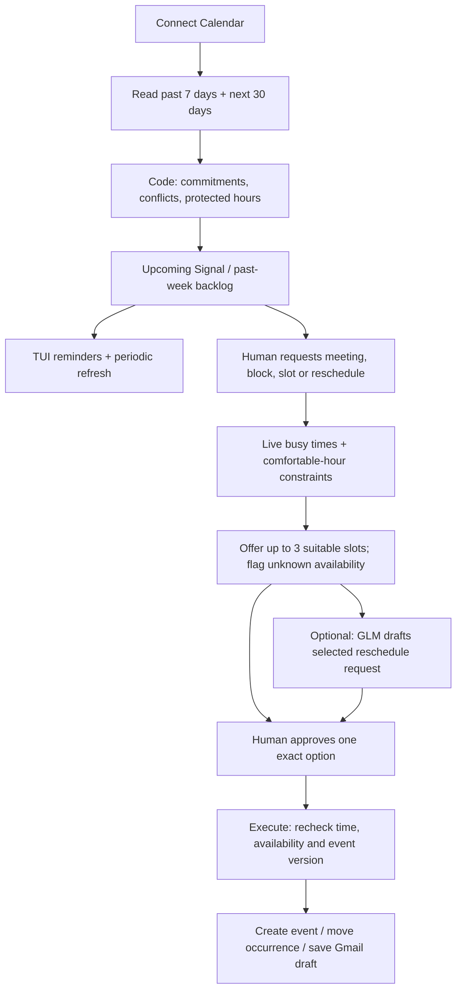

# Calendar agent

Calendar is a separate TUI tab. It uses the same installed Google SDK and can reuse
your Gmail **Desktop OAuth client**, with a separate token for Calendar permissions.
Your Gmail agent token is not modified.

## Google setup

1. In the same Google Cloud project, enable **Google Calendar API**. Keep Gmail API
   enabled for saving reschedule drafts.
2. Keep your existing OAuth app in Testing and your account listed as a test user.
   No website or public app verification is needed for this local test workflow.
3. Start the TUI, select **Calendar agent** with Tab, and press **Connect**. The browser
   requests Calendar read access, event editing, and Gmail draft creation permissions.
   Return to the TUI after consenting.

Configuration is in `.env.example` (matching entries are also added to local `.env`):

```dotenv
CALENDAR_CLIENT_SECRET_FILE=.secrets/gmail-client.json
CALENDAR_TOKEN_FILE=.secrets/calendar-token.json
CALENDAR_ACCOUNT=
CALENDAR_ID=primary
CALENDAR_BUSY_CALENDARS=
```

`CALENDAR_ACCOUNT` can pin the account email. `CALENDAR_ID` selects the calendar to
review and write to. `CALENDAR_BUSY_CALENDARS` optionally lists additional personal
calendar IDs, comma-separated, which must be available for scheduling checks. These
extra calendars contribute busy time; the commitment/backlog view shows the selected
calendar. The calendar's own timezone is the default, editable in Hours.

No new model key is needed: selected reschedule drafts reuse the existing OpenRouter
GLM configuration. Scans, reminders, conflicts and slot searches use no model calls.
Jev is not needed for deterministic calendar data.

## TUI workflow

- **Connect** loads the selected calendar, including the previous 7 days and next 30 days.
- **Scan** refreshes that window. While the TUI is running, a background refresh is
  scheduled every 5 minutes; a currently running task can delay the refresh.
- **B** toggles the past-week backlog. Past events are not assumed completed.
- **Plan [F]** finds times, schedules a meeting, or creates a personal block. Choose
  `find`, `meeting`, or `block`; enter a title, attendee email addresses where needed,
  duration, optional earliest local ISO datetime and search window (up to 30 days).
- **Hours [H]** edits workdays, work hours, meals, sleep, buffer and reminder lead time.
- Select an upcoming event and press **R** to find reschedule options. If you organize
  it, `reschedule` moves that occurrence; otherwise `mail` proposes an email request.
- For a `mail` option, **D** generates the text for that selected slot only. Read it,
  **Approve [A]**, then **Execute [E]** to save a Gmail draft. No email is sent.
- For a meeting, block or event change, **Approve [A]** and **Execute [E]** are also
  separate. Meeting creation and rescheduling send standard Google Calendar guest
  invitations/updates; the approval prompt states this. Blocks have no attendees.
- **L** shows Activity. **0** dismisses the current reminder banner. **Q** quits.

Forms use Tab/arrow keys to select a field, Ctrl-U to clear it, Enter to submit, and
Esc to cancel. Approving one option rejects its alternative slots; it does not book
multiple meetings. Availability is rechecked immediately before execution. Event
changes are checked against the reviewed etag, including an If-Match write condition.
An ambiguous write failure is marked uncertain and is never automatically retried.

## Scheduling and reminders

The accepted defaults are weekdays 09:00–18:00; lunch 12:00–13:00; snack 16:00–16:30;
dinner 19:00–20:00; sleep 22:00–08:00; 15 minutes between meetings. No slot silently
relaxes these constraints. All-day busy events block their calendar dates; recurring
instances, declined invitations, cancellations and timezone offsets are handled.

Attendee free/busy is queried where access permits. Unshared calendars are **unknown**,
not assumed free. That status appears in the proposal before approval. An optional
participant timezone applies the same comfortable-hour defaults in that timezone to
all guests; without it, guests' local hours are explicitly unverified. The agent cannot
know another person's meal preferences or availability they have not shared.

Reminders are **TUI only**, including while viewing another agent tab. The default is
15 minutes before a timed event, or 09:00 on the date of an all-day event. If the TUI
first notices an already-started event, it can still remind you while it is ongoing.
Reminder delivery is deduplicated in local state. Closing the TUI stops monitoring;
there is no background daemon and no macOS notification integration.

## Architecture

- `agents/calendar/tools.py`: normalized events, availability and provider contracts.
- `agents/calendar/tool_implementations.py`: selected GLM reschedule drafts and demo adapters.
- `agents/calendar/control_loop.py`: scan, plan, draft, approve, execute, remind.
- `agents/calendar/agent.py`: account-isolated state, locking and atomic checkpoints.
- `agents/calendar/scheduling.py`: pure timezone-aware interval calculations.
- `providers/calendar.py` and `calendar_auth.py`: Google Calendar/Gmail and OAuth.
- `tui/calendar.py`: Calendar tab and human review controls.



Google references: [scopes](https://developers.google.com/workspace/calendar/api/auth),
[free/busy and per-calendar errors](https://developers.google.com/workspace/calendar/api/v3/reference/freebusy/query),
[event version checks](https://developers.google.com/workspace/calendar/api/guides/version-resources),
[guest update behavior](https://developers.google.com/workspace/calendar/api/v3/reference/events/update).
