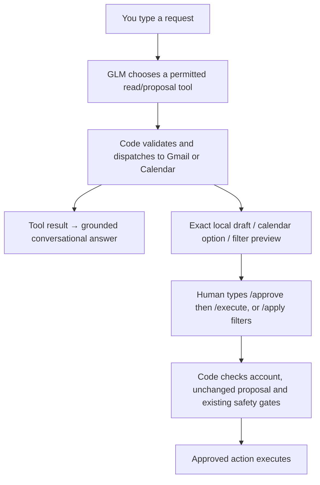

# Chat

The TUI opens on **Chat**. Type a request and press Enter. Use Tab to visit the
existing Gmail and Calendar views; PgUp/PgDn scroll the transcript. You can continue
typing your next message while work runs. Ctrl-Q or `/quit` closes the TUI.

Examples:

- “What needs my attention in my mail and calendar?”
- “Show the urgent emails, then draft a short reply to Alex.”
- “Make that reply warmer, without committing to a deadline.”
- “Include AI research newsletters; exclude sales@example.com.”
- “What commitments do I have tomorrow?”
- “Find a 30-minute slot with alex@example.com next week.”
- “Block an hour for focus work tomorrow.”
- “Draft a reschedule request for my design review.”

Chat reuses the configured GLM model and OpenRouter key. It connects the required
provider on demand using saved credentials, opening consent only if necessary.
The Connect buttons or `/connect email` and `/connect calendar` also work directly.
A name alone is not enough to invent an attendee email; clarify identities when needed.

## Human approval

The model can read, analyze, draft locally, and prepare proposals. It has **no approve,
execute, send, delete, shell, or arbitrary network tool**. Generated proposals appear
verbatim below the conversational reply, including recipients, times and external effects.

- `/show 1` displays the exact proposal again.
- `/approve 1` approves that reviewed version.
- `/execute 1` executes it separately.
- `/reject 1` rejects it.
- `/apply 2` applies reviewed filter changes, if review 2 is a filter proposal.

Use the number shown in each review. Full references such as `email:<id>`,
`calendar:<proposal-id>`, and `filters:<id>` also work. These literal commands are parsed by code,
not interpreted as authorization by the model. “Yes” or “go ahead” in ordinary chat
cannot bypass the gate. Changed proposals must be shown again. Calendar guest invites
can be sent by an explicitly approved calendar action; email actions only create drafts.

Local draft revisions are limited to pending mail proposals. Approved/completed
proposals cannot be silently rewritten. Filter updates preserve unrelated rules and
reject stale edits. Mail screening still respects exclusions, and newsletter preferences
are never inferred just because a message arrived. With no newsletter preferences, a
chat-requested inbox scan can still surface urgent replies while holding newsletters.

Chat history is session-only. Agent proposals, inbox positions, filters and calendar
state retain their existing persistence. Reconnecting a different account clears the
previous chat context on the next turn. Proposal references are bound to their account.

## Architecture

`agents/chat/tools.py` is the model's tool allowlist. `control_loop.py` runs at most
six model steps with bounded history/results. `tool_implementations.py` maps these
calls to the existing mail/calendar operations. `agent.py` manages the conversation
and human commands. `tui/chat.py` presents the transcript and input field.

The existing OpenRouter JSON transport is reused: the model returns a typed tool
request or an answer, and deterministic code validates and dispatches it. There is
no hidden recursive agent spawning. Errors are shown in chat; proposals already
created remain reviewable. Calendar monitoring can be delayed by an active chat task
because operations share one background worker.

`--demo` uses scripted responses and fixture data with no network access. Its phrases
are limited; live mode uses GLM for general conversation. Run the normal launcher with
your environment exported as described in the README.
