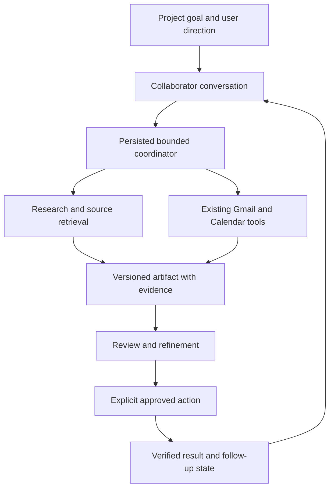

# Collaborators MVP: demo analysis and product recommendation

Research date: 2026-09-28. Deliverable: proposed MVP scope and validation plan, not an implemented product.

## Recommendation

Build a persistent project assistant that helps a solo builder get their first five customer conversations. Present three collaborators—Market Scout, Outreach Partner, and Follow-through Partner—over one shared runtime. Each should produce an actionable result and retain the evidence, decisions, and next step across sessions.

This emulates the demo's onboarding → personalized collaborators → suggested work → background execution → artifact → follow-up experience. It narrows the business promise to something observable. “First five conversations” is a proposed target to validate, not an outcome the software can guarantee.

## What the linked demo actually establishes

I inspected the post and sampled the 2:47 video at the timestamps below in the browser. This is a visual breakdown, not a complete audio transcript or a verification of the product's internal implementation.

Source: [Farza's collaborators demo](https://x.com/FarzaTV/status/2103581812069179417?s=20).

| Approximate time | Visible behavior | MVP implication |
| --- | --- | --- |
| 0:21 | Conversational onboarding asks what a win would be in the next couple of months; fashion-brand context is visible. | Ask for a goal, audience, constraints, and near-term outcome. |
| 0:47 | A named collaborator, Launch Lab, appears in the sidebar. | Give each collaborator a stable job and conversation. |
| 1:10 | Suggestions view offers to find nearby T-shirt warehouses for a first sample; No, Adjust, and Yes controls are visible. Launch Lab, Brand Radar, and Sample Scout appear in the sidebar. | Propose specific, useful work without requiring the user to invent a prompt. |
| 1:34 | Sample Scout shows a working status, progress text about small-run routes, and Stop/Open controls. | Runs need visible progress and cancellation. |
| 2:00 | A formatted apparel research report contains product examples and a recommendation. | Deliver a usable artifact with evidence, not only chat. The report's commercial claims were not independently verified. |
| 2:21 | An apparel product page is visible alongside the caption “Let me pass that along.” | Context sharing matters; this frame alone does not establish precisely how context is captured or routed. |

The post positions collaborators around deciding what to build, finding early users/fans, and earning initial revenue. Those are product promises; the demo does not establish customer outcomes, research accuracy, execution cost, or unattended reliability.

The first-party [HeyClicky changelog](https://www.heyclicky.com/changelog) independently describes persistent named collaborators with memory and files, suggestions informed by connected apps, recurring routines, and follow-up conversations. Therefore memory, proactivity, multiple characters, and recurring tasks alone are not credible differentiation. This recommendation does not assume HeyClicky lacks any proposed feature.

## How the existing ChatGPT research fits

Read the recent relevant exchanges in [Agent Stack Options](https://chatgpt.com/c/6ab78f81-6ca4-83ee-8ace-6e702e824a3b), particularly the agent map, research-versus-browser distinction, and cost discussion. Treat that conversation as design context, not authoritative provider documentation. Its model names, price figures, and cost estimates are not adopted here.

The useful principle: a customer-facing collaborator and an execution capability are different things. Market Scout owns an outcome; research, browser access, and document generation are capabilities it can invoke. A parser or drafter can remain an ordinary function or bounded model call.

| Layer | MVP choice | Reason |
| --- | --- | --- |
| Collaborator identity | Configuration: job, scoped memory, allowed tools, output requirements | Three personas do not require three independent services. |
| Coordinator | Extend the existing bounded Python loop | Preserve explicit validation and small tool sets. |
| Research | New bounded search/fetch/synthesis adapter | Needed for the demo's main artifact workflow. |
| Email | Reuse existing Gmail module for inbox-derived replies; add a separate cold-outreach draft operation | Current reply drafting is not a general prospecting/sending system. |
| Calendar | Reuse deterministic slot finding and reviewed event proposals | Already matches a downstream customer-conversation workflow. |
| Browser | Add Stagehand only when direct retrieval cannot handle an essential source | Its documented deterministic and AI operations can share one adapter. |
| Coding | Defer delegated coding runtime | Building apps is not required to validate this customer-conversation workflow. |
| Computer use | Defer general desktop control | Adds execution surface without being necessary for the first outcome. |
| Voice | Typed interaction first; push-to-talk after the core loop | Voice can improve demo fidelity but does not establish customer value. |

[Stagehand's documentation](https://docs.stagehand.dev/v4/first-steps/introduction) confirms deterministic browser APIs and AI act/extract/observe primitives. [Browser Use](https://docs.browser-use.com/cloud/quickstart) is an alternative with hosted agents or browser infrastructure; do not integrate both initially. The recommendation to start with simple bounded workflows is consistent with [Anthropic's guidance](https://www.anthropic.com/engineering/building-effective-agents).

## The smallest credible experience

1. **Describe one project.** Ask what is being built, who it serves, what progress means, and the user's time/budget constraints. Save a short brief the user can correct.
2. **Meet three collaborators.** Market Scout finds evidence about customer problems and places to meet prospects. Outreach Partner turns selected evidence into specific outreach drafts. Follow-through Partner tracks responses, next actions, and proposed meeting times.
3. **Receive three suggested jobs.** Each states a deliverable and why it advances the project. Accept, edit, or dismiss. Generate these at onboarding, on request, and after relevant project events; continuous monitoring is unnecessary initially.
4. **Run one job in the background.** Show actual progress, sources inspected, cancellation, failures, and a bounded budget. Start with one active run; a queue is sufficient for the pilot.
5. **Review a tangible artifact.** Example: five relevant communities or public prospects, with source links, fit rationale, evidence date, and an appropriate way to approach them. Return fewer results if evidence is insufficient.
6. **Act on selected results.** Prepare three personalized outreach drafts. Keep sending manual initially. Save a Gmail draft only after exact review and once the new draft operation exists; local copyable drafts suffice for the first slice.
7. **Return to continue.** Remember which prospects were selected, what the user changed, what was sent manually, and the next follow-up. Confirm sent/replied status from evidence or the user; never infer it from draft creation.

UI: one project screen, collaborator list, conversation, run status, artifact pane, and action cards. Use original naming and visual design. A normal local window or browser interface is enough; notch integration, animated avatars, and cursor overlays are later polish.

For a closer reproduction of the fashion example, configure the same runtime as Brand Researcher, Supplier Scout, and Launch Planner. That variant requires product/supplier research and structured comparison artifacts, not a new swarm architecture. Treat supplier claims and inferred popularity as unverified until supported by evidence.

## Reuse and necessary additions

The [implementation inventory](existing-agent-capabilities.md) verifies existing Gmail triage, reply refinement, calendar scheduling, proposal persistence, exact review/execution gates, and a shared terminal chat. Its inspection also identifies coupling between chat dispatch and TUI adapters.

The largest gaps are durable project/conversation memory, research, artifacts, project-level task state, cold-outreach drafting, and a visual interface. Chat history is currently session-only. Calendar monitoring runs while the TUI is open. There is no general research or browser tool in the current chat allowlist. Email execution saves reply drafts and does not send them.

Keep the current account boundaries, stale-source checks, and ambiguous-write handling. Extract an interface over domain operations before introducing the new UI. Retain current domain state stores initially rather than migrating everything at once.

Proposed additions:

- `Project`: goal, audience, constraints, explicit preferences, accepted decisions.
- `Collaborator`: job, project reference, tool permissions, scoped conversation.
- `Run`: objective, state, checkpoint, step/time budget, errors, usage counters.
- `Artifact`: versioned content, source references, associated run.
- `FollowUp`: prospect/source reference, current status, next check, supporting evidence.

Persist new project/run records in local SQLite. A run state machine should distinguish queued, running, needs-input, completed, failed, and cancelled. External actions retain a separate approval/execution state. Suggested work cannot approve its own external effects. Restart must recover pending work without duplicating writes.

## Where to differentiate

These are hypotheses ranked by fit with this repository, not proven gaps in the market.

| Direction | Concrete value | Principal uncertainty | Recommendation |
| --- | --- | --- | --- |
| First customer conversations for solo builders | Research → selected prospect → tailored draft → reply → meeting → learning | Will it find reachable, relevant people and improve response quality? | First pilot; closest to the demo's business promise. |
| Client follow-through for freelancers/small agencies | Connect client commitments to drafts, deadlines, and calendar time | Requires full email-thread context and low missed-commitment rates. | Strong alternative; highest reuse of existing tools. |
| Apparel launch assistant | Compare suppliers, sample options, constraints, and outreach | Supplier data quality and domain expertise may dominate. | Closest visual demo replica, but less demonstrated advantage for this repo. |
| Context-aware Focus assistant | Use permitted work context to resume projects with less explanation | Context relevance, privacy expectations, and user trust need validation. | Later enhancement once the core workflow works. |

Potential improvements to test:

- **Show why this task matters:** connect each suggestion to the accepted goal and evidence; measure useful suggestions rather than suggestion volume.
- **Carry work through to outcomes:** distinguish a report produced, a draft saved, a message sent, and a conversation booked.
- **Share decisions across collaborators:** an audience change should invalidate stale prospect work instead of leaving three contradictory chats.
- **Make research auditable:** attach sources and dates; distinguish observed evidence from inferred demand. A product listing is not proof of sales.
- **Learn from corrections:** explicitly retain “too broad,” “wrong audience,” or “already contacted” feedback and stop repeating those suggestions.

Do not position these as features the competitor lacks. Differentiate through measured quality and focus on a specific buyer.

## Build sequence and acceptance gates

Planning estimate: roughly 10–15 engineering days for one experienced engineer using the existing backend, assuming provider access and a local single-user pilot. Native polish, account onboarding for public distribution, and broader integrations require additional work.

| Order | Deliverable | Acceptance gate |
| --- | --- | --- |
| 1 | Project persistence, collaborator profiles, durable conversations | Restart preserves the goal, accepted decisions, and each conversation. |
| 2 | Search-grounded Market Scout and artifact renderer | An unseen project yields a useful, cited artifact; unsupported claims are marked or omitted. |
| 3 | Visual suggestions, progress, cancellation, refinement | Accepting a suggestion starts a real run; an edit produces a revised artifact; cancel stops further scheduled work. |
| 4 | Selected prospect → local draft → follow-up record; connect existing reply/calendar paths | No invented contact identities, no “sent” status from draft creation, no duplicate external writes on retry. |
| 5 | Pilot evaluation and optional voice | Users can complete the core workflow without coached prompts. |

The first vertical slice should finish steps 1–3 for one collaborator before adding the other two. Use genuine live retrieval for the core demo, plus fixtures for repeatable tests. Clearly label any fixture mode.

## Validation and economics

Recruit five solo builders who already have an idea and are actively looking for users. Run a one-week pilot. Suggested go/no-go targets—not existing results:

- Four of five independently obtain a useful first artifact in one session.
- At least three use or substantially adapt one outreach draft.
- At least three return to continue the same project during the week.
- Audit 20 completed research runs; target at least 90% of sampled material factual claims supported by their cited sources.
- Track real replies and booked conversations, but do not attribute them to the product without comparison to each user's normal workflow.

Record input/output/cached tokens where available, search calls, browser time, elapsed time, retries, and accepted outcomes per run. Compare the same tasks against a single well-prompted general assistant. More collaborators are justified only if they improve completion, context continuity, or user effort; they do not inherently save tokens.

Set configurable run limits before the pilot and stop with partial results when exhausted. Calculate cost per useful artifact and per completed workflow using actual provider invoices/rates. Avoid pricing an unlimited agent product from the earlier chat's unverified per-task estimates.

## Deliverable status

This work adds research and a concrete scope; it does not implement the new MVP. The existing repository's automated suite passed 108 tests during the capability inventory. That does not validate live provider behavior, the proposed research flow, or the product hypotheses above.
